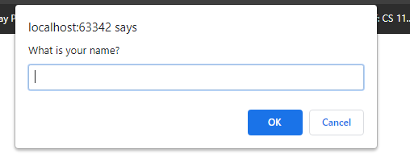
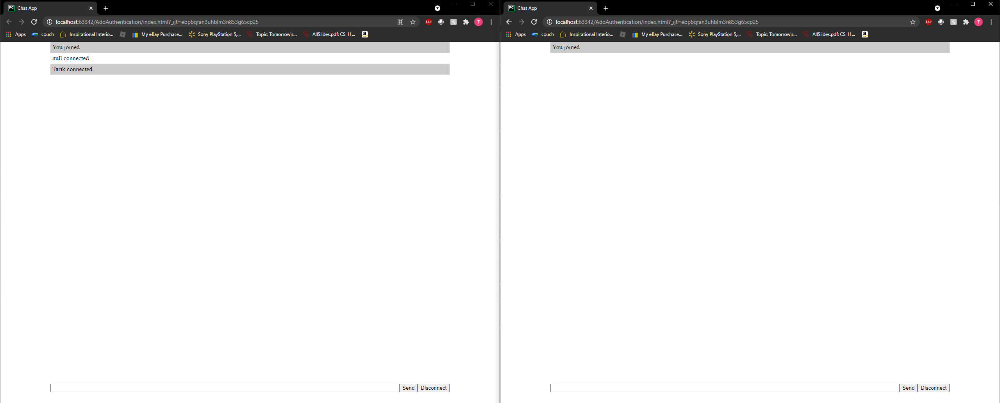
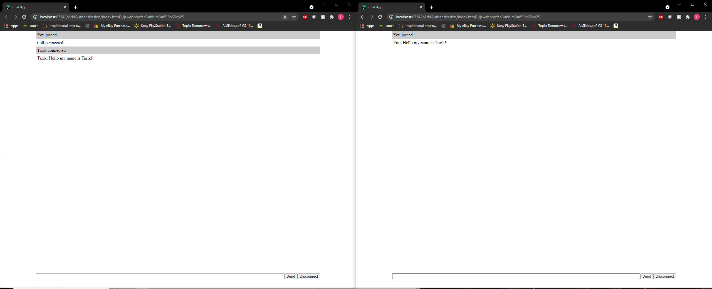
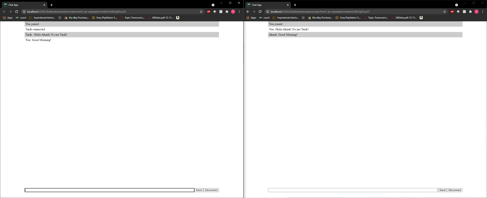

# AddAuthentication - Akash Patel

# Add Chat Feature- Tarik Amraoui

* This chat feature uses nodemon to host the server, as well as socket.io 
to host websockets to allow communication. In order to communicate, 
both participants must be on the same server.

#To have this working correctly, in the terminal do the following

* $ "npm init" will set up our file to use npm 
* $ "npm i socket.io" will install dependencies for socket.io
* $ "npm i --save-dev nodemon" this is our dev dependency, it will also allow nodemon to refresh our page
automatically so we don't have to close the server everytime we make a change.
* $ "npm run devStart" this is the command to start our node.js server as per server.js

  

  
 -This figure above shows successful connection between Akash and I.
 -It clearly states that I connected, as well as Akash by presenting our names- followed by connected

  
 
  
 -This figure shows me and Akash having a conversation.
 -It shows my name followed by the messages. It happens instantaneously.
 
 